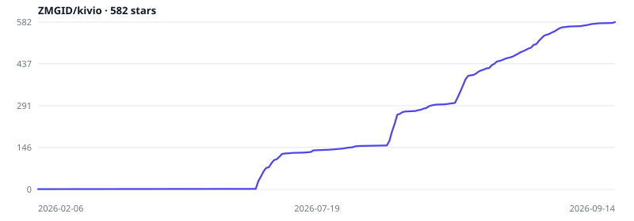

<div align="center">


# Kivio Desktop

### A screen-level AI assistant for macOS and Windows: an agentic client, plus translation, screenshot OCR, and visual Q&A

[](https://github.com/ZMGID/kivio/releases/latest)
[](https://github.com/ZMGID/kivio/releases)
[](https://tauri.app/)
[](https://github.com/ZMGID/kivio/releases/latest)
[](LICENSE)

[中文](README.md) · **English** · [Changelog](https://github.com/ZMGID/kivio/releases)

[Download](https://github.com/ZMGID/kivio/releases/latest) · [Features](#features) · [Help](#help) · QQ **1104450740**


</div>

Lives in the tray. Hotkeys translate typing, selection, or what's on screen; capture a region and ask. The client is a full agent: tools, sub-agents, Skills, MCP, knowledge base, multi-model replies.

Bring your own keys. No account, no proxy, no telemetry. Data stays on disk.

## ❤️ Sponsor

> Want to appear here? Reach us via [GitHub Issues](https://github.com/ZMGID/kivio/issues) or QQ group **1104450740**.

<details open>
<summary>Click to collapse</summary>

<table>
<tr>
<td width="180" align="center" valign="middle">
<a href="https://hezubus.cc"></a>
</td>
<td>
Thanks to <a href="https://hezubus.cc">Hezubus</a> for sponsoring this project. <a href="https://hezubus.cc">Hezubus</a> provides official, stable, high-speed API relay for GPT, Claude, and other models, with enterprise customization, invoicing, and 7×16h dedicated support. It also offers a purpose-built WebSocket connection for faster time-to-first-token. Codex subsidy rates go as low as 0.08×. <a href="https://hezubus.cc">Register here</a>.
</td>
</tr>
</table>

</details>

## Why Kivio

Text on screen, a captured region, and coding CLIs you already installed do not need three apps. Kivio keeps them in one tray process: hotkeys anywhere, your own providers.

- **One loop, many hosts** — built-in Agent, research-only Kivio Chat, and local external CLIs (Claude Code, Codex, Cursor, OpenCode, Gemini, Kimi, Pi, Hermes, Grok, DeepSeek Harness) share the same chat UI
- **Screen tools** — quick, selection, screenshot, and in-place replace translation; Lens freezes the display, lets you ask and annotate, and can hand the thread back to chat
- **Bring your own keys** — OpenAI Chat Completions / Responses, Anthropic, Gemini, Grok (xAI Responses). Translator, screenshot, Lens, and each conversation can use a different model
- **Extensions** — Skills, MCP, knowledge base, sub-agents, plugins, connectors; a right dock with file tree, Git, and a terminal
- **Cross-platform** — macOS (Apple Silicon) and Windows 10/11, built with Tauri 2

## Screenshots

| Chat | Settings |
| :--: | :------: |
|  |  |

<p align="center">
  
</p>

<p align="center">
  
</p>

## Features

Full history: [Releases](https://github.com/ZMGID/kivio/releases) · current notes: [v2.9.5](docs/releases/v2.9.5.md)

### Chat & agent

- Tool loop, sub-agents, Skills, MCP, knowledge base, attachments; one question, many models
- Three runtimes: Kivio Agent (full tools), Kivio Chat (search / fetch / knowledge base, read-only), external CLI
- Hand a conversation to Claude Code, Codex, Cursor, OpenCode, Gemini, Kimi, Pi, Hermes, Grok, or DeepSeek Harness if they are installed
- Import native CLI sessions (pinned to the original CLI and working directory)

### Translate & Lens

- Quick, selection, screenshot OCR, and in-place replace translation
- Lens: freeze the screen, select a region (or a window on macOS), ask, annotate (arrow / rect / mosaic), send the thread back to chat
- OCR: system engines (Apple Vision / Windows OCR) or an optional offline RapidOCR pack

### System

- Global hotkeys (remappable, conflict-aware), tray, light / dark
- Usage stats, lifecycle hooks, optional chat-window keep-alive (hide instead of destroy)

## Hotkeys

Toggles, remappable in Settings.

| Action | macOS | Windows |
|---|---|---|
| Open chat | `⌘⇧K` | `Ctrl+Shift+K` |
| Quick translate | `⌘⌥T` | `Ctrl+Alt+T` |
| Screenshot translate | `⌘⇧A` | `Ctrl+Shift+A` |
| Selection translate | `⌘⇧T` | `Ctrl+Shift+T` |
| Replace translate | `⌘⇧R` | `Ctrl+Shift+R` |
| Lens | `⌘⇧G` | `Ctrl+Shift+G` |

## Download

### Requirements

- **macOS**: Apple Silicon (`.dmg` is unsigned)
- **Windows**: Windows 10 / 11 (Edge WebView2; usually already installed)

Get the latest from [Releases](https://github.com/ZMGID/kivio/releases/latest):

- macOS: `Kivio.Desktop_*_aarch64.dmg`
- Windows installer: `Kivio.Desktop_*_x64-setup.exe`
- Windows portable: `Kivio.Desktop_*_x64-portable.zip`

The DMG is unsigned. First launch: right-click → Open, or:

```bash
xattr -cr "/Applications/Kivio Desktop.app"
```

macOS needs **Accessibility** and **Screen Recording**. Then follow the onboarding wizard.

## Help

- [Changelog](https://github.com/ZMGID/kivio/releases) — downloads and highlights
- [Issues](https://github.com/ZMGID/kivio/issues)
- QQ group **1104450740**

## Quick start

1. Install Kivio and finish onboarding (provider + hotkeys).
2. **Add a provider**: Settings → Providers → Add → pick a preset (or custom) and paste an API key.
3. **Chat**: `⌘⇧K` / `Ctrl+Shift+K`, pick a model, send. Switch to a local CLI from the runtime picker when you need one.
4. **Screen**: use a translate hotkey or Lens; grant permissions in system settings.

## FAQ

<details>
<summary><strong>Do I need an account? Where is my data?</strong></summary>

No account. Keys live in local `settings.json`. Conversations, knowledge bases, and notes live under the app data directory:

- Windows: `%APPDATA%\com.zmair.kivio`
- macOS: `~/Library/Application Support/com.zmair.kivio`

No telemetry. Requests go only to the providers you configure.

</details>

<details>
<summary><strong>Which external CLIs are supported?</strong></summary>

If they are installed: Claude Code, Codex, Cursor, OpenCode, Gemini, Kimi, Pi, Hermes, Grok, DeepSeek Harness. Availability is probed on the machine; model catalogs load lazily for the selected CLI.

</details>

<details>
<summary><strong>macOS says the app is damaged / cannot be opened?</strong></summary>

The build is unsigned. Right-click → Open, or run `xattr -cr "/Applications/Kivio Desktop.app"`. Screenshot and replace translation also need Screen Recording.

</details>

<details>
<summary><strong>Why can’t I continue an imported CLI chat on another model?</strong></summary>

Import is a display snapshot. The history still belongs to the original CLI. Continuation uses that CLI’s native session and stays on the original working directory. See [ADR-0001](docs/adr/0001-imported-cli-conversations-stay-on-their-cli.md) and [ADR-0002](docs/adr/0002-imported-history-is-a-snapshot.md).

</details>

## Development

<details>
<summary><strong>Environment and commands</strong></summary>

You need Node.js, npm, Rust, and Tauri 2 platform deps. macOS also needs Swift for the OCR sidecar.

```bash
npm install
npm run dev          # Rust + UI (builds Swift sidecar on macOS)
npm run dev:ui       # Vite only
npm run lint
npm run typecheck
npm test
```

Rust tests:

```bash
# macOS / Linux
cargo test --manifest-path src-tauri/Cargo.toml

# Windows (use the script; plain cargo test binaries may fail to launch)
powershell -File scripts/win-cargo-test.ps1
```

Chat-protocol types are generated from Rust. After a protocol change:

```bash
npm run protocol:generate
npm run protocol:check
```

</details>

<details>
<summary><strong>Architecture</strong></summary>

```
┌─────────────────────────────────────────────────────────────┐
│              Frontend (React 18 + Vite + Tailwind)           │
│   One bundle, four windows: main / chat / lens / translate   │
└────────────────────────┬────────────────────────────────────┘
                         │ Tauri IPC · chat-protocol
┌────────────────────────▼────────────────────────────────────┐
│                 Backend (Tauri 2 + Rust)                     │
│   AgentHost loop (prepare → planning → rounds → synthesis)  │
│     ├─ GUI chat                                              │
│     ├─ External CLI agents                                   │
│     └─ Sub-agents                                            │
└─────────────────────────────────────────────────────────────┘
```

- Live chat uses the versioned `chat-protocol` (`npm run protocol:check` verifies generated types)
- Provider adapters: OpenAI Chat, Anthropic Messages, Gemini, OpenAI Responses (including xAI Grok)
- Settings in `settings.json` (including API keys); conversations under `conversations/`; crash drafts in a JSONL journal

Module map: [CLAUDE.md](CLAUDE.md).

</details>

## Contributing

[Issues](https://github.com/ZMGID/kivio/issues) and PRs are welcome. Before a PR, please run:

- `npm run lint`
- `npm run typecheck`
- `npm test`

Open an issue first for larger features. Tracker conventions: [docs/agents/issue-tracker.md](docs/agents/issue-tracker.md).

## Star History

[](https://github.com/ZMGID/kivio/stargazers)

## License

[GPL-3.0-or-later](LICENSE) © ZM
