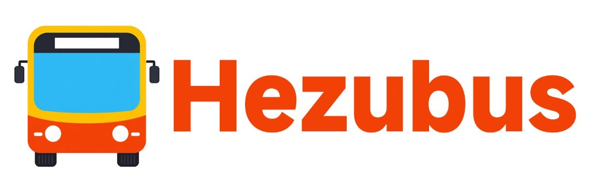
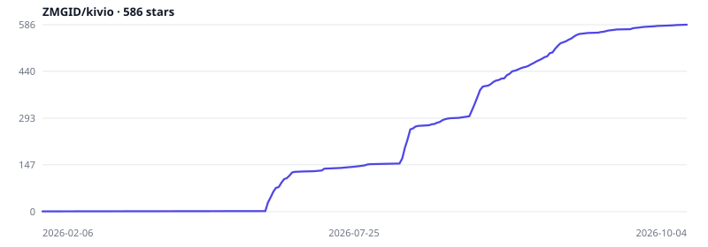

<div align="center">


# Kivio Desktop

### A screen-level AI assistant for macOS and Windows: an agentic client, plus translation, screenshot OCR, and visual Q&A

[](https://github.com/ZMGID/kivio/releases/latest)
[](https://github.com/ZMGID/kivio/releases)
[](https://tauri.app/)
[](https://github.com/ZMGID/kivio/releases/latest)
[](LICENSE)

[中文](README.md) · **English** · [Changelog](https://github.com/ZMGID/kivio/releases)

[Download](https://github.com/ZMGID/kivio/releases/latest) · [Features](#features) · [Help](#help) · QQ **1104450740**


</div>

Lives in the tray. Hotkeys translate typing, selection, or what's on screen; capture a region and ask. The client is a full agent: tools, sub-agents, Skills, MCP, knowledge base, multi-model replies.

Bring your own keys. No account, no proxy, no telemetry. Data stays on disk.

## ❤️ Sponsor

> Want to appear here? Reach us via [GitHub Issues](https://github.com/ZMGID/kivio/issues) or QQ group **1104450740**.

<details open>
<summary>Click to collapse</summary>

<table>
<tr>
<td width="180" align="center" valign="middle">
<a href="https://hezubus.cc"></a>
</td>
<td>
Thanks to <a href="https://hezubus.cc">Hezubus</a> for sponsoring this project. <a href="https://hezubus.cc">Hezubus</a> provides official, stable, high-speed API relay for GPT, Claude, and other models, with enterprise customization, invoicing, and 7×16h dedicated support. It also offers a purpose-built WebSocket connection for faster time-to-first-token. Codex subsidy rates go as low as 0.08×. <a href="https://hezubus.cc">Register here</a>.
</td>
</tr>
</table>

</details>

## Why Kivio

Text on screen, a captured region, and coding CLIs you already installed do not need three apps. Kivio keeps them in one tray process: hotkeys anywhere, your own providers.

- **One loop, many hosts** — built-in Agent, research-only Kivio Chat, and local external CLIs (Claude Code, Codex, Cursor, OpenCode, Gemini, Kimi, Pi, Hermes, Grok, DeepSeek Harness) share the same chat UI
- **Screen tools** — quick, selection, screenshot, and in-place replace translation; Lens freezes the display, lets you ask and annotate, and can hand the thread back to chat
- **Bring your own keys** — OpenAI Chat Completions / Responses, Anthropic, Gemini, Grok (xAI Responses). Translator, screenshot, Lens, and each conversation can use a different model
- **Extensions** — Skills, MCP, knowledge base, sub-agents, plugins, connectors; a right dock with file tree, Git, and a terminal
- **Cross-platform** — macOS (Apple Silicon) and Windows 10/11, built with Tauri 2

## Screenshots

| Chat | Settings |
| :--: | :------: |
|  |  |

<p align="center">
  
</p>

<p align="center">
  
</p>

## Features

Full history: [Releases](https://github.com/ZMGID/kivio/releases) · current notes: [v3.1.1](docs/releases/v3.1.1.md)

### Chat & agent

- Tool loop, sub-agents, Skills, MCP, knowledge base, attachments; one question, many models
- Three runtimes: Kivio Agent (full tools), Kivio Chat (search / fetch / knowledge base, read-only), external CLI
- Model provider API keys are optional: chat, model discovery, and connection tests can call the configured endpoint without a placeholder key. Empty keys omit key-authentication headers; server authentication errors are still reported. OAuth providers still require login.
- Hand a conversation to Claude Code, Codex, Cursor, OpenCode, Gemini, Kimi, Pi, Hermes, Grok, or DeepSeek Harness if they are installed
- Import native CLI sessions (pinned to the original CLI and working directory)
- The built-in context panel separates capacity from breakdown: the header uses the latest main request's API-reported input + output tokens, formatted in k (e.g. `53.0k/1000.0k`). Three ranked categories—system prompt (including instructions, memory and injected context), tools (including system tools, MCP and skills), and conversation (including messages, summaries and attachments)—show independent estimated token amounts (`≈`) alongside explicitly labeled character shares. Categories measure the actual prepared request, not a separately reconstructed prompt on refresh. Shares color only the occupied portion; estimates are never scaled to API totals and may not sum to reported usage. Average cache hit rate sums only complete main-request input/cache-read pairs; missing fields are not zero. It is hidden below 78% or when unknown. Refreshes, restores and streaming updates share a measurement sequence, so older snapshots cannot replace newer reports. Missing or invalidated reports remain unknown after compaction, clearing or model switches, including switching back. Local estimates never replace the reported total; external CLIs retain their own measurement contract.
- The context popover uses a compact layout. Missing measurements display `—` without waiting or refresh notices; empty categories take no space. Refresh, compact and clear actions remain available.
- Manual and automatic compaction share the configured summary model and retain complete recent message / tool groups within a token budget. Overflow retries never discard the oldest history. Summaries must shrink context, and automatic compaction must also leave headroom; otherwise the original history is retained and failure is reported. Original UI messages are not deleted.
- Media studio: generate images and videos; video results and creation details load the first frame before playback, without autoplay
- Progressive SVG previews in chat: `svg` blocks and SVG-only `html` blocks render during generation, with a source toggle and the last picture preserved for unfinished tags, attributes, or character entities, including Markdown-added trailing newlines. Ordinary HTML pages remain sandboxed previews after generation ends

### Translate & Lens

- Quick, selection, screenshot OCR, and in-place replace translation
- Lens: freeze the screen, select a region (or a window on macOS), ask, annotate (arrow / rect / mosaic), send the thread back to chat
- OCR: system engines (Apple Vision / Windows OCR) or an optional offline RapidOCR pack

### System

- Global hotkeys (remappable, conflict-aware), tray, light / dark
- Usage stats, lifecycle hooks, optional chat-window keep-alive (hide instead of destroy)
- Momo desktop pet: off by default; use **Desktop pet** below **Language** in the sidebar account menu, or **Show Momo desktop pet** in the tray. Both controls stay synchronized with right-click hiding; a failed change keeps the previous state and offers a retry message in the account menu. Native drawing inside the existing app process, with no pet WebView or external process. Reflects thinking, tool work, answering, waiting for input, completion, and failure. Click to poke, drag to move, double-click to open the relevant chat, or right-click to hide. The toggle and position are saved locally; hiding stops animation. No feeding, daily check-ins, or death mechanics. Not available on Linux: the pet is a native macOS/Windows implementation and enabling it reports “Native desktop pet supports macOS and Windows”.
  - The desktop pet is a front-facing ink-blue pebble with small feet. All eight states share one silhouette, facial grid, and prop palette, without stretching during pokes or dragging. Idle uses quiet breathing; thinking has gently rising dots; searching moves its gaze; working taps a compact keyboard; speaking changes its mouth; waiting shows a question mark; completion has smiling eyes and a small hop; failure briefly shakes its head. Only work shows the keyboard. Fine borders keep the keyboard and status cards legible on light and dark backgrounds. Completion briefly acknowledges success before returning to idle; failure and its chat target remain until a new run. Waiting takes priority over other active states. Native geometry and animation live in `src-tauri/src/desktop_pet/sim.rs`; the chat mascot is unchanged.
  - macOS and Windows share flat geometry. Visible body and prop ink accept mouse input; transparent gaps pass through. Nearby pointers attract the idle pet's gaze and stop strolls. Dragging never stretches the body; release saves and keeps the chosen position without gravity or bottom-edge snapping. Short idle strolls occur only at the work-area bottom, never while working or waiting for input. Reduced motion stops animation but keeps state markers. Hiding stops updates; showing restores the saved position.
  - Companion behavior never replaces work state. Idle Momo quietly breathes, blinks, and dozes; nearby pointers and taps wake it. Its feet alternate during bottom-edge strolls. Reduced motion disables these gestures. A tap gets a short response; sustained idle time brings one local line about every four minutes, without model calls or token charges. Speech uses a compact, content-sized rounded native card centered near Momo: white with dark text in light mode, dark with light text in dark mode, updating with the theme. It disappears after ten seconds. Dragging, hiding, locking, and task-state changes dismiss old speech without queuing a replay.
  - Today's tokens and costs appear as separate one-sentence remarks, using the statistics owner's local calendar day and accounting rules. Only calls recorded by Kivio are included; unreported external CLI usage is excluded. Costs may include estimates; missing costs never imply free usage. Read failures and incomplete records are indicated instead of inventing numbers. Reads do not block animation, and stale results cannot reopen speech.
- Computer control: installation/update progress survives page navigation in the same window; completion refreshes tool status, and failures remain visible for retry
- Page tasks: skill and plugin installs, model downloads, media submissions, native-session imports, conversation-library batch actions, and archive / delete / export continue in the same window. Returning shows progress, results, or failures; an in-flight operation cannot be submitted twice. Skills and Media retain their current view. Uninstalling a skill restores its store install action; retired previews, media references, and Pi install callbacks cannot overwrite newer drafts or feedback. This frontend state lasts for the current window; it is not application-restart recovery.
- Editor drafts: note and automation saves continue across navigation. Notes snapshot editor text before navigation so delayed change notifications cannot lose trailing edits. Assistants write only on explicit Save; retired delete or duplicate callbacks cannot clear or replace another editing session. Returning through Tasks restores the automation canvas. Loading a remote version refreshes the canvas, and late reads cannot replace intervening edits, including edits already saved successfully.
- Notes and its rich-text editor load on the first visit, not during chat startup prefetch; later visits in the same window reuse the loaded modules.
- TinyFish authorization: leaving cancels the current flow. A new visit accepts only the new authorization result, never credentials from a retired flow.

### Themes

- Settings → **Themes** independently manages appearance mode, translucent sidebars, and the theme library. Twelve built-ins each include light and dark palettes: Neutral, Warm, Cool; Graphite, Blossom, Grove, Ocean, Ember, and Iris adapted from T3 Code palettes; plus White, Nord, and Solarized. White uses a true `#FFFFFF` light background rather than Neutral's off-white. Nord combines cool blue-gray surfaces with icy blue accents; Solarized pairs cream / deep teal surfaces with teal accents. The original nine palettes are unchanged.
- Theme cards show light/dark thumbnails and support arrow-key preview selection. Duplicate a built-in theme to edit grouped surfaces, text/borders, accents, and danger colors using synchronized color pickers and HEX inputs. Editing includes a live preview and adapts to a single column in narrow windows. Preview leaves the current interface unchanged; save, then choose Apply theme. Saving changes to the active custom theme updates it immediately.
- Editor drafts survive navigation between settings pages, and failed saves can be retried. Deleting the active custom theme restores Neutral. Themes are stored with local settings and included in settings backups.
- JSON sharing: the export dialog displays the complete document for copying; paste it into the import dialog to preview and save. Escape closes the dialog and restores focus to its trigger. Version `1` contains `theme` with `name`, `light`, and `dark`; both palettes require all 17 color fields as `#RRGGBB`. Import creates a new ID rather than overwriting a same-name theme. Arbitrary CSS is not supported.
- Interface surfaces and text use semantic theme colors across chat messages, approval and question cards, runtime menus, Markdown diagrams, automation canvases, usage statistics, Lens controls, image viewers, and knowledge-base settings. Changes to an active custom palette propagate to these surfaces. Screenshot and image pixels, brand icons, syntax highlighting, and status indicators retain their own colors; themes do not globally replace white.
- On refresh, the first frame restores the last applied light/dark palettes before the application bundle and backend settings load. Loading surfaces follow the theme, and System mode reevaluates the current OS appearance. The paint cache stores colors only, never providers or credentials; authoritative backend settings replace it after loading. Once the content shell mounts, the canvas returns to transparency for native materials and capture overlays. Unavailable browser storage does not prevent applying the backend theme.

## Hotkeys

Toggles, remappable in Settings.

| Action | macOS | Windows |
|---|---|---|
| Open chat | `⌘⇧K` | `Ctrl+Shift+K` |
| Quick translate | `⌘⌥T` | `Ctrl+Alt+T` |
| Screenshot translate | `⌘⇧A` | `Ctrl+Shift+A` |
| Selection translate | `⌘⇧T` | `Ctrl+Shift+T` |
| Replace translate | `⌘⇧R` | `Ctrl+Shift+R` |
| Lens | `⌘⇧G` | `Ctrl+Shift+G` |

## Download

### Requirements

- **macOS**: Apple Silicon (`.dmg` is unsigned)
- **Windows**: Windows 10 / 11 (Edge WebView2; usually already installed)

Get the latest from [Releases](https://github.com/ZMGID/kivio/releases/latest):

- macOS: `Kivio.Desktop_*_aarch64.dmg`
- Windows installer: `Kivio.Desktop_*_x64-setup.exe`
- Windows portable: `Kivio.Desktop_*_x64-portable.zip`

The DMG is unsigned. First launch: right-click → Open, or:

```bash
xattr -cr "/Applications/Kivio Desktop.app"
```

macOS needs **Accessibility** and **Screen Recording**. Then follow the onboarding wizard.

## Help

- [Changelog](https://github.com/ZMGID/kivio/releases) — downloads and highlights
- [Issues](https://github.com/ZMGID/kivio/issues)
- QQ group **1104450740**

## Quick start

1. Install Kivio and finish onboarding (provider + hotkeys).
2. **Add a provider**: Settings → Providers → Add → pick a preset (or custom) and paste an API key.
3. **Chat**: `⌘⇧K` / `Ctrl+Shift+K`, pick a model, send. Switch to a local CLI from the runtime picker when you need one.
4. **Screen**: use a translate hotkey or Lens; grant permissions in system settings.

## FAQ

<details>
<summary><strong>Do I need an account? Where is my data?</strong></summary>

No account. Keys live in local `settings.json`. Conversations, knowledge bases, and notes live under the app data directory:

- Windows: `%APPDATA%\com.zmair.kivio`
- macOS: `~/Library/Application Support/com.zmair.kivio`

No telemetry. Requests go only to the providers you configure.

</details>

<details>
<summary><strong>Which external CLIs are supported?</strong></summary>

If they are installed: Claude Code, Codex, Cursor, OpenCode, Gemini, Kimi, Pi, Hermes, Grok, DeepSeek Harness. Availability is probed on the machine; model catalogs load lazily for the selected CLI.

</details>

<details>
<summary><strong>macOS says the app is damaged / cannot be opened?</strong></summary>

The build is unsigned. Right-click → Open, or run `xattr -cr "/Applications/Kivio Desktop.app"`. Screenshot and replace translation also need Screen Recording.

</details>

<details>
<summary><strong>Why can’t I continue an imported CLI chat on another model?</strong></summary>

Import is a display snapshot. The history still belongs to the original CLI. Continuation uses that CLI’s native session and stays on the original working directory. See [ADR-0001](docs/adr/0001-imported-cli-conversations-stay-on-their-cli.md) and [ADR-0002](docs/adr/0002-imported-history-is-a-snapshot.md).

</details>

## Development

<details>
<summary><strong>Environment and commands</strong></summary>

You need Node.js, npm, Rust, and Tauri 2 platform deps. macOS also needs Swift for the OCR sidecar.

```bash
npm install
npm run dev          # Rust + UI (builds Swift sidecar on macOS)
npm run dev:ui       # Vite only
npm run lint
npm run typecheck
npm test
```

Rust tests:

```bash
# macOS / Linux
cargo test --manifest-path src-tauri/Cargo.toml

# Windows (use the script; plain cargo test binaries may fail to launch)
powershell -File scripts/win-cargo-test.ps1
```

Chat-protocol types are generated from Rust. After a protocol change:

```bash
npm run protocol:generate
npm run protocol:check
```

</details>

<details>
<summary><strong>Architecture</strong></summary>

```
┌─────────────────────────────────────────────────────────────┐
│              Frontend (React 18 + Vite + Tailwind)           │
│   One bundle, four windows: main / chat / lens / translate   │
└────────────────────────┬────────────────────────────────────┘
                         │ Tauri IPC · chat-protocol
┌────────────────────────▼────────────────────────────────────┐
│                 Backend (Tauri 2 + Rust)                     │
│   AgentHost loop (prepare → planning → rounds → synthesis)  │
│     ├─ GUI chat                                              │
│     ├─ External CLI agents                                   │
│     └─ Sub-agents                                            │
└─────────────────────────────────────────────────────────────┘
```

- Live chat uses the versioned `chat-protocol` (`npm run protocol:check` verifies generated types)
- Provider adapters: OpenAI Chat, Anthropic Messages, Gemini, OpenAI Responses (including xAI Grok)
- Settings in `settings.json` (including API keys); conversations under `conversations/`; crash drafts in a JSONL journal

Development conventions: [Engineering standards](docs/engineering-standards.md).

</details>

## Contributing

[Issues](https://github.com/ZMGID/kivio/issues) and PRs are welcome. Before a PR, please run:

- `npm run lint`
- `npm run typecheck`
- `npm test`

Open an issue first for larger features. Tracker conventions: [docs/agents/issue-tracker.md](docs/agents/issue-tracker.md).

## Star History

[](https://github.com/ZMGID/kivio/stargazers)

## License

[GPL-3.0-or-later](LICENSE) © ZM
