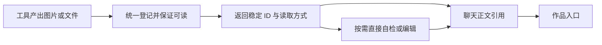

# Kivio 生成文件的直接读取与统一作品管理

日期：2026-09-20。代码基线：`7a0c1ebe`。本轮只调研，未修改业务代码、未重新调用收费生图接口、未删除用户文件。本文是设计建议和证据记录，工程规则继续以 [engineering-standards.md](../engineering-standards.md) 为准。

## 结论

建议先补全现有 artifact 的“生成 → 保存 → 读取 → 展示”通路，再基于同一份记录建立作品入口。Kivio 已有稳定 ID 和正文引用，当前缺的是完整生命周期，不能靠新增一个附件列表消除模型找文件的等待。

产品上统一文件访问和操作，同时保留来源差异：用户上传的是输入资料；模型交付的是作品；自检截图、抽帧和临时导出是过程文件。同一文件可以用于多个场景，不为切换用途复制文件，也不把每个临时 PNG 都当作作品。

## 1. 实际问题和量化证据

读取了用户截图对应的“动漫头像生成”本机会话，只提取工具名、参数、时间和结果摘要；未将原始会话、图片内容或本机路径复制入仓库。

| 第一轮指标 | 实测值 |
|---|---:|
| 生图工具执行 | 28,634 ms |
| 生图结束到 assistant 消息时间戳 | 31 秒 |
| 后续找文件/比哈希的 bash 调用 | 6 次 |
| 这 6 次调用的执行耗时合计 | 16,345 ms |
| 随后直接读图 | 1 次，191 ms |
| 此头像在该会话附件目录的相同内容副本 | 9 份，每份 2,317,734 字节 |

31 秒是记录中完成时间的差值，包括后续推理、工具往返和输出；不是逐帧 UI 首次显示时间，也不能声称优化后必定省去全部 31 秒。6 次命令里包含一次失败调用；这并非 6 次都成功找到文件。

SHA-256 检查确认这 9 份内容完全一致；该会话其余两组生成图也各有 4 份相同副本。只计第一张便有约 17.7 MiB 的重复内容。此处只统计 `artifact-*.png`，不把缩略图或模型输入缓存混算，也不据此认定所有副本都可以立即删除。

### 已运行的记录审计

在 PowerShell 中令 `$tracePath` 指向这份本机 conversation JSON，然后运行：

```powershell
$trace = Get-Content -LiteralPath $tracePath -Raw | ConvertFrom-Json
$turn = $trace.messages | Where-Object {
  $_.tool_calls.name -contains 'mixer_generate_image'
} | Select-Object -First 1
$searches = @($turn.tool_calls | Where-Object {
  $_.name -eq 'bash' -and $_.arguments -match 'find |ls |md5sum'
})
[pscustomobject]@{
  generationMs = $turn.tool_calls[0].duration_ms
  postGenerationSeconds = $turn.timestamp - $turn.tool_calls[0].completed_at
  discoveryCalls = $searches.Count
  discoveryExecutionMs = ($searches | Measure-Object duration_ms -Sum).Sum
} | ConvertTo-Json
if ($searches.Count -gt 0) {
  Write-Output 'FAIL: filesystem discovery after successful image generation'
  exit 1
}
```

已运行结果：`generationMs=28634, postGenerationSeconds=31, discoveryCalls=6, discoveryExecutionMs=16345`，退出码 1。它是可重复的历史症状审计，**不是修复后能变绿的实时回归测试**。用户本轮要求先调研，因此未实施修复或重新生图；实现阶段必须建立下文的运行时测试，再采集新 trace 对照，不能修改旧记录让检查变绿。

## 2. 三项假设与代码核对

在核对实现前按以下顺序检查：工具是否没有返回可读地址；读图是否不能接收已有 ID；重复保存是否制造不同路径。

### A. 生图输出只建立了展示通路：确认

[`image_generation.rs`](../../src-tauri/src/chat/image_generation.rs) 构造的 `ChatToolArtifact` 有完整图片数据、展示名，初始 `path: None`，而 `follow_up_user_messages` 为空。工具正文还输出 ``，这个显示名并不是工作目录内的文件。

[`agent/execute.rs`](../../src-tauri/src/chat/agent/execute.rs) 随后分配 `art_…` ID。`artifact_presentation_hint` 给模型 ID、名称、MIME 和最终引用语法，没有提供 ID 读取方法或已存在的文件地址。实际聊天的工具摘要与此完全一致。

所以模型知道“图已经生成，最终可以引用”，却不能通过该返回值直接看图。模型自己的解释仅是线索；上述工具输出和代码才是依据。

### B. 相同 ID 在不同操作间不通用：确认

- 前端已经按 ID 解析正文引用，且会话级 Map 支持引用前轮结果：[artifactReferences.ts](../../src/chat/artifactReferences.ts)、[MessageList.tsx](../../src/chat/MessageList.tsx)。无需重新实现一套引用语法。
- 生图的再次编辑已经接受 `artifact_ids`，会从当前草稿及已保存消息中解析图片：[image_generation.rs](../../src-tauri/src/chat/image_generation.rs) 的 `resolve_mixer_artifacts` / `input_image_from_artifact`。
- `read` 的 schema 和执行入口仍只处理 `path/paths`，不处理 artifact ID：[mcp/types.rs](../../src-tauri/src/mcp/types.rs) 的 `native_read_file_tool`、[native_registry.rs](../../src-tauri/src/mcp/native_registry.rs) 的 `call_read_file`。

表现为：同一张图能按 ID 展示、再次生成编辑，但不能按 ID 自检。这是当前最直接的接口缺口。

### C. 大图保存不是对原运行结果的一次性登记：机制吻合，副本已证实

[`commands/messages.rs`](../../src-tauri/src/chat/commands/messages.rs) 保存草稿时克隆工具记录；[`draft_journal.rs`](../../src-tauri/src/chat/draft_journal.rs) 对这个草稿副本做图片外置。外置后的路径没有返回并更新原运行记录。

[`attachments.rs`](../../src-tauri/src/chat/attachments.rs) 的 `externalize_image_artifact_in_dir` 对无可用 path 的大图使用随机 UUID 文件名写盘。下轮再拿原始、无 path 的图片保存，会再次产生文件。终态保存也沿用该外置逻辑。与实际相同图片、不同名字和写入时间的副本相吻合。

这是强代码证据，但本轮未给每次写入安装运行探针，不能把 9 个文件逐一归因到具体函数调用。还需在实现阶段增加“同一个原始产物连续保存多轮，只出现一份原图”的回归测试。模型输入媒体已有内容哈希路径可参考，别机械复制一套新缓存。

## 3. Claude 值得借鉴的是什么

详细官方来源与新旧产品差异见 [Claude Artifacts 调研](claude-artifacts-2026-09-20.md)。新版自动保存创作到 Artifacts，支持作品独立入口、后续修改和版本；上传附件与作品并不是同一概念。截图中的 Docs / Slides / Design 入口有官方资料支持，但无需把三个在线编辑器一起纳入 Kivio 首版。

借鉴重点是“同一个结果可找回、可继续使用”，而不是照搬界面或推测 Claude 内部存储。公开资料没有披露它如何把工具结果映射到磁盘文件、筛选所有临时产物或做去重。

MCP 工具结果本身可返回图片、音频、资源链接、内嵌资源和结构化结果；资源可以按需读取。这支持将外部结果适配为统一描述，而不是一律只拼一段说明文字。它不替 Kivio 定义作品、版本或展示策略。[MCP 工具规范](https://github.com/modelcontextprotocol/modelcontextprotocol/blob/main/docs/specification/2025-11-25/server/tools.mdx)

Kivio 当前 [`mcp/result.rs`](../../src-tauri/src/mcp/result.rs) 主要把 image 转成 artifact、text 转文字、内嵌 resource 转紧凑 JSON；未见 audio / resource_link 的统一产物分支。此项是扩展适配范围，不能误说本次内置生图故障由 MCP 服务器造成。

## 4. 建议的统一规则

以下为拟议产品/数据语义，未作为新工程规范或已实施 ADR。

| 概念 | 定义与规则 |
|---|---|
| 文件资源 | 有稳定 ID、名称、MIME、大小、来源和访问方式；原图、缩略图分别管理。输入、生成、外部引用可共用访问能力。 |
| 来源 | 区分用户上传、工具生成、外部 CLI 文件、MCP 资源；保留来源会话/消息/调用，不能把上传资料变成“AI 创作”。 |
| 作品 | 用户要保留、下载、继续编辑的结果。例如头像、报告、表格、演示、网页。可聚合多个文件，不等于磁盘目录中的每个文件。 |
| 版本 | 一次明确更新产生不可变版本；“换一种颜色”更新同一作品，“再给两套方案”是候选或分支。由操作明确关联，不按相似文件名猜。 |
| 展示引用 | 聊天正文指向具体产物/版本；同一文件可被预览和交付，显示位置不改变原文件身份。旧回答不可悄悄改成最新内容。 |
| 内容去重 | 相同字节可复用存储；同哈希不意味着两个独立作品需要合并。重复保存不应产生新作品或新版本。 |
| 可用状态 | 明确准备中、可用、缺失、失败。工具返回可用必须意味着能按约定读取；磁盘满或保存失败应报告“生成但保存失败”。 |

最小实现先沿用 `art_…`、`ChatToolArtifact`、conversation 和现有附件目录，补齐稳定读写，避免立即重建数据库、迁移全盘或引入多层服务。需要跨聊天独立保留作品时，再把作品记录与会话引用拆开；资源索引只是可重建的查询索引，不是第二个可变事实来源。

### 模型和界面的最短路径



由 chat 现有产物/附件能力负责登记、解析、持久化和引用；生图、read、MCP 适配和前端共享这个入口。不是让每个调用方自己安排“复制文件 → 登记 → 存草稿 → 找路径”。已有 mixer ID 解析应移入这个共同归属，再让 read 复用，不能新增另一份遍历消息找 ID 的实现。

对模型的返回应包含：精确 ID、显示名、MIME、实际数量、可用的读取/编辑方式。去掉把展示名伪装成可读相对路径的 Markdown。内部工具可按 ID 读取；需要 shell 或文档工具处理时，由解析入口给出真实本地路径，而不是让模型搜索 AppData。

默认采用按需读图：`read` 接受现有 artifact ID，沿用主模型视觉/视觉模型/OCR 路径。不把所有 MCP 截图、大图都自动塞入模型输入。若后续实测证明内置生图自动反馈更快，可增加有数量和大小限制的反馈，且必须维持本次已修复的“所有工具结果先完成，再附图”顺序。展示产物不等于模型已经看过它。

### 用户入口

- 聊天内：生成步骤显示进度；文件可用后立即能打开。最终答复仍在相应段落展示必要作品，避免另加重复附件墙。
- 当前会话：可查看所有相关文件，按输入、生成结果和过程文件筛选；过程文件可找回但默认不挤进作品集。
- 全局“作品”：先做搜索、类型筛选、预览/系统打开、另存为、回到来源聊天、继续修改。已交付的创作结果默认入库；仅作为回答证据引用的截图不必自动成为独立作品，可手动保留。
- 同一报告的源稿和 PDF 导出归同一作品；不同头像候选可独立选择。图片预览、文件下载、代码/HTML 预览按实际能力提供，暂不承诺 Office 原生编辑器或云分享。

前端已有文件卡、图片查看器、HTML 预览及右侧文件面板可复用：[GeneratedFileArtifacts.tsx](../../src/chat/GeneratedFileArtifacts.tsx)、[attachmentPreview.ts](../../src/chat/attachmentPreview.ts)、[RightDock.tsx](../../src/chat/dock/RightDock.tsx)。统一操作应由 ID 解析，不再让组件按“裸文件名还是绝对路径”分别猜测。

## 5. 实施顺序与验收

### 第一批：先消除生图后的查找

1. 在工具结果成为成功之前，为产物建立幂等的持久化身份；保存只写引用，缩略图是派生物，原图失败不能假装成功。
2. 扩展现有 read 使用 artifact ID，并共用 mixer 的解析能力；供需要路径的消费者取得真实可读文件。
3. 工具结果不再给假文件链接，明确按 ID 查看、按 ID 编辑、按 ID 交付；不要用“禁止所有自检”掩盖定位缺口。
4. 用真实执行入口的固定图片响应替代收费上游建测试，再做一次端到端生成验证。

通过标准：同场景无需定位文件的 `find/ls/md5sum`；必要自检最多一次直接定位读取；连续保存 10 次只留一份原图且引用不变；停止、重启、再次编辑后都能取到同一原图。记录原图保存耗时、工具成功到可打开的时间及最终答复时间，不能把生图网络耗时和后处理混算。模型自主步骤不保证每次相同，用新 trace 验证实际减少。

### 第二批：统一生成文件生命周期

让内置生成、MCP 图片/资源、选定本地文件走同一登记入口；完善缺失文件、导出、跨轮引用和继续编辑。常规代码写入、日志与构建输出不自动全盘扫描入作品。

通过标准：同名不同文件不串图；一个文件多次读取不生成新作品；重开不丢引用；旧数据内联图片/裸文件名/绝对路径仍能读取；能力不支持的格式有明确下载或外部打开入口。

### 第三批：作品入口和版本

在前两批稳定后增加全局作品入口、明确版本关系、同作品多文件和来源跳转。建立独立作品保留语义后，删除会话不直接销毁仍被作品/其他会话引用的内容；作品删除、旧版本保留与清理规则需在界面明确。

通过标准：旧消息保持原版本；新编辑增加版本；重复保存不增版本；跨会话引用可追溯；删除会话不误删已保留作品；无引用缓存按完整引用集清理。

## 6. 兼容约束和边界

- 遵守 [ADR-0001](../adr/0001-imported-cli-conversations-stay-on-their-cli.md)、[ADR-0002](../adr/0002-imported-history-is-a-snapshot.md)：外部 CLI 历史仍是显示快照，续聊留在原 CLI/原工作目录。统一产物并不意味着接管其原生会话或后台同步历史。
- 外部 CLI 的工作目录文件可登记为引用；若承诺“作品永久可用”，须保存明确快照。不能一边引用可变源文件，一边宣称旧版本内容不变。
- 解析范围由当前会话/明确的跨会话引用授权决定；ID 不是任意读盘通行证。MCP 返回的 ID/路径不能冒充 Kivio 已登记能力，保留后端验证。
- 旧附件只做可恢复的惰性兼容；清理必须覆盖作品版本、草稿、模型输入和聊天引用，复用并扩展现有 [gc.rs](../../src-tauri/src/chat/gc.rs)。本轮没有清理副本。
- 本次观察还发现请求两张、接口只返回一张；当前结果摘要按实际数量返回。它不是查找文件的主因，若另行优化候选数量，需单独检查供应商响应，不能因数量不足自动重复收费生成。

建议下一步从第一批开始，随后统一文件契约，再建设作品入口；不建议先实现整套 Claude 式在线编辑与分享平台。

## 7. 首版落地与验证（2026-09-20）

- 唯一负责人是 `chat/artifacts.rs`：在工具成功发布前完成原文件快照与 ID 登记；内置生图、直接生图模型、MCP 结果、选定的本地交付文件共用这个入口。原文件按 SHA-256 保存，作品记录保留独立身份和来源。
- `read` 增加会话范围的 `artifact_ids`，与图片编辑共用解析入口。读取已登记作品保持相同 ID；旧聊天仍保留原 ID 和版本，不改写历史消息。
- 侧边栏增加“作品”页：搜索、类型筛选、网格/列表、原图和文本/PDF 预览、系统打开、另存为、来源聊天跳转。单张图片按单个父 artifact 编辑时形成版本组。Office 文件使用系统应用打开；首版不包含在线 Office 编辑、分享协作及批量清理。
- 旧聊天按会话 revision 惰性导入，成功导入后跳过未变化的会话；有问题的导入继续可重试。历史自检的同图副本保留 ID，但作品列表只展示其生成原件。当前本机有 3 张旧项目截图的源路径已失效，显示导入提示，不把缩略图冒充原文件。
- 原重复保存回归用例在修复前得到 10 个原图路径，修复后连续 10 次保存只有 1 个原图。原图快照、重复登记、来源文件删除、错误内容和历史自检去重均有 Rust 测试。
- 真实 `deepseek-flash` 测试：`mixer_generate_image` → `read({artifact_ids:[id]})` → 最终图片引用；无 `bash/find/ls/md5sum`。生图工具 17,406 ms，按 ID 读取 6 ms，整轮 25,735 ms；工具完成到最终答复约 3 秒。两次工具记录的 ID 和原文件路径相同。测试图片与原截图内容不同，这些数值是本次端到端观察，不是同图片性能基准。
- 桌面实测已打开旧头像原图，并通过系统保存框导出 2,060,378 字节 PNG，SHA-256 与管理目录原图一致。
- 续图验收额外复现中转兼容问题：`gpt-image-2` 编辑返回 `400 Bad Request: images[].image_url is required`。本地 HTTP 回归测试也在原实现上失败。现在仅命中这一明确的参数错误时，把 `image` 转为 `images[].image_url` 后重试一次，保留全部参考图，不回退成无参考图生成；超时、5xx 和其他 400 不触发此转换。类似 JSON 格式可见[兼容服务商接口文档](https://hdcubq8n9e.apifox.cn/8709324m0)，本次适配判据来自实际接口响应，不把它推广为所有供应商的统一格式。
- 外部应用打开文件时使用新副本，避免编辑器直接覆盖管理目录内的历史版本。用户主动另存为的导出位置由系统保存框选择。
- 修复后真实续图成功：保留原 artifact 作为编辑输入，只调用一次生图工具和一次按 ID 读取；新记录的 `workId`、`parentId` 均指向原作品，原图仍可读取，整轮 31,709 ms。生图模块 31 项测试、作品持久化 5 项测试、页面与路由 98 项测试通过，另已通过类型/协议检查、架构检查、变更文件 lint 和前端构建。
