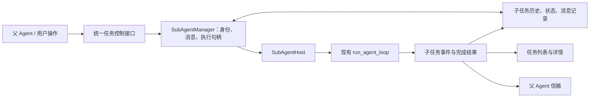

# SubAgent 重构准备：Codex 官方源码研究与 Kivio 对照

研究日期：2026-09-12。目的：为后续重构建立可核查的行为模型、边界和验收依据；本次不修改运行时代码。

后续定稿：六项产品决定记录在 [ADR-0005](../adr/0005-subagents-retain-identity-across-tasks.md)，当前重构范围与验收以 [本地规格](../prd/subagent-runtime-refactor-spec.md) 为准。本文保留研究时的建议与候选接口，不能视为全部已确认；规格尚未实现。

## 1. 范围与结论

最值得借鉴的不是工具名称，而是将 **Agent 的身份和历史、一次 Turn 的执行、消息投递、等待订阅、资源驻留** 拆开。Codex 的 spawn 工具只负责创建子线程并提交首个输入，不负责等待整个任务完成；之后由独立控制入口操作同一 Agent。这个结构才能同时支持“中途补充信息”“单独停止”“完成后继续”“每件事新开一个”。[创建与提交路径][spawn-core]

证据分为三类：本文标为“源码事实”的内容来自固定提交；“官方文档”描述产品/API；“建议”是针对 Kivio 的设计判断。不能用 Codex 桌面界面的表现证明所有开源 CLI 都有相同行为，也不能把现有对话环境提供的 collaboration 工具当成开源版本的规范。

- 官方仓库：[openai/codex](https://github.com/openai/codex)。本次证据覆盖公开仓库中的 Rust core、CLI 与 App Server 相关代码，不据此断言桌面客户端或托管运行时全部开源。
- 固定提交：`c4017a87aacc7558002b7cb510025e967c1d765e`。
- 提交时间：`2026-09-12T05:04:11Z`；标题：`Make context snapshot text rendering consistent (#44976)`。
- 获取方式：2026-09-12 浅克隆官方仓库 HEAD，随后所有源码研究使用本地固定 checkout；不是对某个已发布稳定版本的承诺。
- 本地参考 checkout：`C:/Users/11028/AppData/Local/Temp/codex-subagent-research-20260912`。
- Kivio 基准 HEAD：`118d4874b82371a9a57b9879450dc892ca3fb73d`；工作区观察应同时考虑未提交修改。
- 验证方式：源码、测试实现和官方文档交叉阅读。没有编译或运行 Codex 的 Rust 测试；文中列出的测试是已读测试，不是本次测试通过声明。

## 2. Codex 当前有两代实现，必须先区分

固定提交同时保留 V1 和 V2。`multi_agent` feature 默认启用；`multi_agent_v2` 被标记为 Stable，但默认关闭。实际工具注册按当前 Turn 的 `MultiAgentVersion`、模型能力和配置决定；因此，“最新源码包含 V2”不等于“所有 Codex CLI 默认使用 V2”。[feature 默认值][features]、[工具选择][tool-select]

| 维度 | V1 | V2 |
|---|---|---|
| 启动 | `spawn_agent`，返回子线程标识 | `spawn_agent`，返回规范任务路径及可选昵称 |
| 投递 | `send_input`，可先 interrupt；同一输入接口负责 start/steer | `send_message` 只入信箱；`followup_task` 入信箱并允许启动下一 Turn |
| 等待 | `wait_agent` 订阅指定目标状态，等待最终状态之一 | `wait_agent` 等调用方信箱活动或新用户输入，不直接返回子任务全文 |
| 停止与恢复 | `close_agent` / `resume_agent` | `interrupt_agent`；已卸载对象由消息路径尝试按需加载 |
| 列举 | 以 ID 和状态为主 | `list_agents`，支持任务路径过滤 |
| 资源 | registry 的 spawned thread 名额 | 活跃执行限额与驻留线程容量分开 |

表中行为依据各工具实现和注册分支；V2 的等待工具还可通过配置关闭，namespace 也由配置和 provider 能力决定。不要把工具字符串写死为永远相同的公共协议。[V1 投递][v1-send]、[V1 等待][v1-wait]、[V2 注册][tool-register]、[V2 消息][v2-message]

后续 Kivio 如果目标是用户刚才描述的交互能力，应主要借鉴 **V2 的控制面与信箱**，并吸收 V1 的显式关闭语义；不必复刻其全部角色配置、模型路由、上下文缓存和驻留优化。

## 3. 执行模型：spawn 异步不等于没有任何等待

### 3.1 实际返回点

源码事实：`spawn_agent_internal` 依次做容量检查、驻留/registry 预留、创建或 fork 线程、提交 registry 元数据、通知客户端新线程、持久化父子边、提交初始输入，然后返回 `LiveAgent { thread_id, metadata, status }`。返回前确实要等待这些准备步骤；它没有 await 子任务的最终回答。[spawn 核心][spawn-core]

V2 工具层把首个任务包装成 `InterAgentCommunication(trigger_turn=true)`，交给控制层。工具返回给模型的是任务路径及可选昵称；子线程实际运行、之后消息处理与父线程的工具调用 future 解耦。[V2 spawn][v2-spawn]

建议：Kivio 的 `spawn` 成功回执应表示“任务已被可靠接纳，获得可查询的 ID”，而不是“任务已经做完”。业务任务耗时不能占据父工具回执生命周期。仍须定义准备失败如何清理，以及回执丢失时如何按幂等键找到已经创建的 Agent。

### 3.2 Agent、Thread、Turn 是不同维度

源码事实：每个根线程树共享同一个 `AgentControl`，它持有 registry、执行限额、驻留管理等控制能力，并弱引用 `ThreadManagerState`，避免 manager→thread→session→services→manager 的强引用环。子 Agent 有独立 Thread，而一次新任务是其 Thread 上的一个 Turn。[AgentControl][control]

`AgentStatus` 从事件派生：TurnStarted→Running，TurnComplete→Completed 或 Errored，普通 TurnAborted/Interrupted→Interrupted，ShutdownComplete→Shutdown。`is_final` **排除 PendingInit、Running 和 Interrupted**。这意味着“当前 Turn 被中断”和“Agent 最终完成/销毁”不是同一个语义。[状态映射][status]

建议：Kivio 不应只用 `running/completed/failed` 一个枚举同时表达工具调用、子运行、线程是否仍可接收消息。可分别保存 Agent 生命周期、当前 Run 状态、最近结果和可用操作能力。

## 4. 中途投递：入信箱、触发 Turn 与消费边界

### 4.1 V2 区分消息与后续任务

源码事实：两种消息工具共用 dispatcher，差别是 `QueueOnly` 与 `TriggerTurn`。路径解析得到目标，确认目标属于 registry，必要时 `ensure_v2_agent_loaded`，然后提交带 author/recipient/trigger_turn 的通信。`followup_task` 拒绝目标 root；普通 send_message 可以向 root 发消息。[共享消息处理][v2-message]

session handler 先把通信加入 `InputQueue`，再让 pending-work scheduler 决定空闲 session 是否启动常规 Turn。通常只有 trigger_turn=true 才尝试启动；代码还包含 durable sleep 的特殊唤醒条件，所以“send_message 永不唤醒任何状态”过于绝对。[session 收件入口][mail-handler]

在活跃 Turn 内，InputQueue 管理待消费内容；模型流完成一条 reasoning 或 commentary 项目后，如果信箱已有消息，采样循环可以提前结束本次采样，进入后续处理。工具调用不是同样的抢占点，不应承诺正在执行的工具收到消息后会即时停止。[采样边界][preempt]、[InputQueue][input-queue]

在回答边界之后，消息被延后到下一 Turn；新用户 steering 或后续工具调用可能重新打开当前 Turn 的投递窗口。这不是“每来一条消息都另开一个并行模型请求”。对应测试明确覆盖 queued mail、trigger-turn mail、steer、tool-call 四种边界。[回答边界测试][mail-tests]

### 4.2 V1 send_input 与 steer

源码事实：V1 `send_input(interrupt=true)` 先提交 interrupt，再提交输入。底层 `AgentControl::send_input` 使用 `start_or_steer_turn`：空闲时 Start，运行时 Steer；返回的 submission ID 是回执，不是完成结果。[V1 send_input][v1-send]、[控制层 start/steer][control-input]

建议：Kivio UI 可以给出“补充信息”“停止并重新交代”两种行为，但后端必须区分。修改输入文本不是修改已执行操作；任何 interrupt 都不能自动撤销先前文件写入。

### 4.3 消息可靠性不能从当前源码过度推断

源码事实：InputQueue 使用进程内 `Mutex<VecDeque<...>>`；交接暂停路径明确指出 pending accepted input 和交互等待器只在当前进程中，持久化/重放它们需要单独协议。存在已消费通信历史持久化，不足以证明“已接纳但未消费信箱”也具有断电可靠性。[InputQueue][input-queue]、[暂停路径注释][suspension]

建议：如果 Kivio 要向用户承诺“已提交的信息重启后也不丢”，必须自己设计 messageId、目标 agent/run、accepted/consumed/rejected 状态和事务性持久化。不能因为参考了 Codex 就默认拥有 exactly-once 投递或副作用执行。

## 5. 等待与完成通知

源码事实：V2 wait 先订阅调用方 InputQueue 活动并获取已有 pending activity；已有消息可立即返回，否则等待 watch receiver 变化或截止时间。Mailbox、Steer、TimedOut 映射为不同回执；回执只有摘要和 `timed_out`，消息正文通过信箱进入上下文。[V2 wait][v2-wait]

这将“阻塞等待”限制在显式 wait 操作：父 Agent 有别的工作就继续；没事可做时才等。不是把所有子任务集合 `join_all` 后才允许父 Agent 再次推理。V1 使用指定目标的 status watch，语义不同。[V1 wait][v1-wait]

源码事实：V2 的完成通知从 session 事件路径发往直接父 Agent 的信箱，`trigger_turn=false`；会检查 TurnComplete/TurnAborted，再经过 `is_final` 过滤，因此普通 Interrupted **不走这个完成通知**。父 Agent 已退出/不可接收时，代码记录投递失败，没有在这个函数中实现一个持久 outbox 重试。V1 则由 detached completion watcher 观察状态。[V2 完成通知][completion]、[旧 watcher][watcher]、[状态过滤][status]

建议：Kivio 的任务状态是权威事实，UI 事件和父消息是派生通知。完成时先落盘结果及 runId，再生成可重放通知。父 Turn 已结束也必须能查询子结果；是否主动开启新的父 Turn应作为显式产品策略，避免通知无限互相唤醒。

## 6. 中断、关闭、恢复和真正暂停

| 操作 | 固定提交中的事实 | 重构含义 |
|---|---|---|
| V2 interrupt_agent | 发送 Op::Interrupt，回传 previous_status；拒绝 root 和 self；目标已卸载等情况可作为成功处理 | 回执不能冒充“所有工具进程已终止”的确认 |
| Session interrupt | abort 当前 session 的 active task，清理 pending input；路径本身不是树级关闭 API | 停本轮、停单 Agent、停整个树需要明确区分 |
| V1 close_agent | 将持久父子边标为 Closed，shutdown 自身及当前内存树可达后代，移除线程并释放资源 | close 是生命周期操作，不只是设置 UI 状态 |
| shutdown_live_agent | flush rollout、请求 Shutdown、等待线程终止、移除 loaded thread、释放 registry/residency；不标显式 Closed | 卸载与用户关闭也应区分 |
| V1 resume_agent | 缺失时从存储恢复；底层可遍历 open 子边，明确 closed 后代不应重新打开 | 恢复历史对象不等于从 CPU 指令位置续跑 |
| V2 cold load | 从 registry/存储重建线程，恢复角色/环境等；V2 resume 不主动重开整棵后代树 | 用消息时按需加载，避免恢复全部线程 |
| suspend_turn_and_shutdown | 独立的交接功能，只接受 regular task；有 live descendants 则拒绝；flush 后取消且不记录普通终态 | 不应将 interrupt 简单改名为“暂停” |

依据：[interrupt 工具][v2-interrupt]、[session 中断][session-interrupt]、[当前任务取消][task-abort]、[close/shutdown][legacy-close]、[恢复入口][resume-core]、[V2 cold load][cold-load]、[真实暂停路径][suspension]。

研究边界：上述源码证实这些独立控制原语；本报告不把单 Session 的 interrupt 推断成所有桌面入口的“停止全部”行为，也不把 App Server、CLI、桌面 UI 的停止传播策略混为一谈。后续实现应按 Kivio 的明确产品契约验证树级取消，而非靠父 cancellation token 的偶然生命周期。

特别限制：上游有 `interrupted_v2_agent_is_lost_after_residency_eviction` 测试，在该测试构造条件下，中断对象被驻留管理卸载后，再 cold load 返回 ThreadNotFound。不能从“V2 有 cold load”推出“任意 Interrupted 都能恢复”。这是测试可证实的边界，不泛化为全部生产运行都会丢失。[相关驻留测试][residency-tests]

## 7. 并发、资源回收与上下文

### 7.1 V2 分离执行与驻留

源码事实：`AgentExecutionLimiter` 用 active 计数和 guard 表达 V2 子 Agent 的活跃 Turn，guard Drop 时减计数；root 和 V1 Turn不计入这套限额。容量不足的入口返回 AgentLimitReached，而非一直排队等待 semaphore。[执行容量][execution]、[执行计数测试][execution-tests]

驻留管理另有 residents + pending_slots。容量不足时尝试 LRU 卸载 idle 子线程；只有 Completed/Errored/Interrupted、无 active_turn、无 pending mail 的候选可卸载。卸载前物化历史并 shutdown，保存环境选择，移除 manager 内的 loaded thread。不能卸载任何对象时返回容量错误。[驻留管理][residency]

建议：Kivio 第一版不必做 LRU，但必须让运行名额、存储记录保留、Agent 是否可继续三个概念分开。执行 timeout 从实际开始计时；排队等待若支持，应有单独 deadline。资源预留用 RAII/统一 finally 回收，并为启动中断、准备失败、任务 panic 设置故障注入测试。

### 7.2 上下文 fork

源码事实：V2 `fork_turns` 默认 all，可为 none 或正整数。fresh 创建新历史；full/last-N 走 fork。fork 不是把父 messages 无脑复制：核心处理会选取模型上下文、过滤历史项目、清理父使用量/提示片段、修复 spawn call 对应项，并处理压缩与最近 N 轮不可完整证明时的截断情况。[V2 参数][v2-spawn]、[fork 核心][fork-core]、[fork 测试][fork-tests]

建议：Kivio 首先保留 fresh 的可预测路径，再增加有版本号的 ContextSnapshot。明确父历史截断点、角色指令来源、模型差异、工具调用配对和父授权继承。不要复制尚未闭合的工具调用，或者把父 Agent 的使用量作为子 Agent 初始使用量。

### 7.3 权限和文件隔离

源码事实：spawn 从当前 Turn 构造配置，显式应用实时 approval policy、permission profile、cwd；角色等配置不是任意突破父运行时策略的途径。代码把 cwd 继承给子 Agent，所读普通 spawn 路径没有自动建立 worktree。[运行时配置继承][spawn-policy]

因此，独立上下文不代表独立文件系统。建议 Kivio 为同目录并行写入明确约束，优先划分文件所有权；自动 worktree 是独立功能，需要处理依赖、未提交修改及结果合并，不应在第一阶段隐式引入。

## 8. 官方产品/API 文档补充

官方 Subagents 文档描述将具体任务分给专门 Agent、并行工作、结果回传和角色配置；这支持将子任务视为独立协作对象，但不是上述每个内部状态机的规范。[官方 Subagents](https://learn.chatgpt.com/docs/agent-configuration/subagents)

App Server 官方文档提供 Thread、Turn、Item 及其请求/通知协议，可用于 Kivio 前后端投影设计的参考。应把启动回执、执行中事件、Turn 结束事件分开处理；文档层协议不等于内部 V2 工具协议。[官方 App Server](https://learn.chatgpt.com/docs/app-server)

另外两份一手资料只用于交叉验证设计选择，不代替 Codex 源码：

- Claude Code 官方区分 foreground（父流程等待）与 background（并行）。普通子 Agent可以保留历史后 resume，而 Explore/Plan 是一次性对象；worktree 隔离需要另选。当前文档允许后台审批转交主会话，不能沿用旧版“后台总是自动拒绝审批”的描述。对 Kivio 的启示是执行模式、生命周期与隔离模式应是三个明确策略。[Claude Code Subagents](https://code.claude.com/docs/en/sub-agents)
- Tokio 官方说明丢弃 JoinHandle 只会 detach，调用 abort 是取消请求，随后 await 才能观察终止；已经开始的 spawn_blocking 不能靠 abort 停止。对 Kivio 的启示是 manager 必须持有执行句柄并完成回收，区分“停止已请求”和“已确认停止”，不能只加 tokio::spawn 再丢弃句柄。[Tokio JoinHandle](https://docs.rs/tokio/latest/tokio/task/struct.JoinHandle.html)

## 9. 值得迁移的测试模式

以下为已阅读的上游测试，不代表本次执行通过。

| 模式 | 上游证据 | Kivio 对应验收 |
|---|---|---|
| 首次派发、fresh/fork | control_tests 中 creates_thread_and_sends_prompt、fork 清理及 Last-N | spawn 能迅速回执，后续模型调用独立；快完成也不漏事件 |
| 消息接受与消费分离 | input_queue FIFO、queued mail 不启动 turn | 空闲消息持久保留，后续任务消费顺序明确 |
| 回答边界竞态 | session/tests 的 answer boundary、steer reopen | 完成同时补充信息不会丢失、误插到旧 Run |
| wait 无消息/已有消息/超时 | multi_agents_tests 的 V2 wait 系列 | 订阅时不丢刚发生的事件，timeout 不取消子任务 |
| 中断目标检查 | interrupt 拒绝 root/self、接受已卸载目标 | UI/API 统一鉴权和幂等，不操作过期 Run |
| 容量与失败回收 | execution guards、resume failure release slot | 成功/失败/取消/panic 都不泄漏名额 |
| 关闭和恢复树 | close/resume 测试保留显式 closed 子树 | 关闭后不会因恢复父 Agent而意外重启 |
| 状态通知 | completion queues direct parent、dead direct parent | 子结果留存与父通知分开验证 |
| 冷加载与权限 | cold resume/lazy inheritance、evicted parent authority | 恢复后权限不扩大，缺失授权上下文有明确处理 |

测试定位：[控制层测试][control-tests]、[工具测试][tool-tests]、[消息边界测试][mail-tests]、[执行容量测试][execution-tests]、[驻留测试][residency-tests]。

## 10. Kivio 重构准备：从现有代码到可实施的接口

本节是结合上游事实与 Kivio 当前代码提出的设计建议，不是 Codex 的接口规范，也不表示这些能力已在 Kivio 实现。

### 当前内置 SubAgent 的实际能力

| 能力 | 当前状态 |
|---|---|
| 派工 | 单个 `agent` 工具，接收完整 prompt、角色及工具限制 |
| 并行 | 同一模型消息中多个调用并行；父循环等待本批全部返回 |
| 途中通信与继续 | 没有子 Agent 专用消息/后续任务工具，也未接入主循环信箱 |
| 中断 | 父 generation 取消会级联；没有独立子 Agent 的模型控制工具或卡片按钮 |
| 历史与资源 | 每次重建 system+user；进程内结果表按数量回收；没有完整子历史恢复契约 |
| 文件隔离 | 上下文隔离，工具仍使用父对话工作目录；没有自动 worktree |

证据：[子任务定义、配置与阻塞返回](../../src-tauri/src/chat/sub_agent.rs)（839、704、1230、1276 行）、[并行批次等待](../../src-tauri/src/chat/agent/rounds.rs)（421 行）、[展示卡片](../../src/chat/ToolCallBlock.tsx)（564 行）。这里审查的是内置运行时；外部 CLI 子 Agent 由对应 CLI 管理，不能用它的后台任务能力替代内置实现。

此前审查的两条风险仍需在阶段 0 通过生产控制路径的测试覆盖：

1. **任务级重试会丢失已执行历史。** `run_sub_agent` 在空回答错误后从初始 system+user 重跑；如果前面已经写入文件或执行命令，可能重复副作用。模型步骤内部已有保留历史的一次空回答重试，但耗尽后仍可进入外层重跑。[外层重试](../../src-tauri/src/chat/sub_agent.rs)（683—793 行）、[模型步骤重试](../../src-tauri/src/chat/agent/planning.rs)（379—395 行）、[终答错误传播](../../src-tauri/src/chat/agent/finalize.rs)（295—307 行）。
2. **并发排队消耗子任务执行期限。** `execute_tool_call` 开始超时计时后才进入子任务 semaphore 等待。默认约 660 秒包含排队；例如并发 1、同批三个各需 5 分钟的任务，第三个只剩约 1 分钟执行。超时应明确区分排队和执行阶段。[外层计时](../../src-tauri/src/chat/agent/execute.rs)（315—323、946—947 行）、[排队](../../src-tauri/src/chat/sub_agent.rs)（1230 行）。这是静态调用路径结论，本次未等待 11 分钟做真实超时复现。

### 现有代码中值得保留的部分

- 继续复用 `run_agent_loop`，不要另建一套模型请求、工具执行、压缩和用量统计循环。`AgentRunResult` 已提供 `api_messages`、`compacted_history`、`tool_records` 和 `usage`；子任务最终整理阶段目前只保留结果预览与用量，未来可由运行宿主持有完整历史。[Kivio 结果结构](../../src-tauri/src/chat/agent/types.rs)、[现有整理逻辑](../../src-tauri/src/chat/sub_agent.rs)
- 复用轮次边界的消息注入机制，但为子 Agent 实现自己的接收入口。`ChatAgentHost` 已覆盖 `take_steering_messages` / `take_follow_up_messages`；`SubAgentHost` 沿用返回空数组的默认实现。[主宿主](../../src-tauri/src/chat/commands/agent_host.rs)、[默认接口](../../src-tauri/src/chat/agent/host.rs)
- 保留角色定义、工具筛选、技能加载、模型选择与进度卡。它们解决的是“任务如何执行”，无需为了异步调度全部重写。[现有子任务实现](../../src-tauri/src/chat/sub_agent.rs)、[工具筛选](../../src-tauri/src/chat/agent/filter.rs)

### 不能直接沿用的假设

| 当前假设 | 异步后会出现的问题 | 建议处理 |
|---|---|---|
| 子任务活跃依赖父 generation 活跃 | 父轮正常结束也可能终止仍有价值的子任务 | 区分父轮正常完成、用户停止整棵任务树、应用关闭 |
| 状态属于启动工具卡 | 启动回执被误当任务完成，后续轮次无独立身份 | 分开记录工具调用、Agent 身份与执行轮次 |
| 按名称查找使用全局 `by_name` | 不同对话同名角色覆盖映射 | 身份用稳定 ID；名称仅在父任务树内解析 |
| 父 run 结束后拒收事件 | 异步任务结果无法进入原 run 回放 | 为任务树或子 run 建独立事件流与快照 |
| 信箱接收成功后靠前端重发兜底 | Agent 之间没有前端队列，关窗/结束轮次可能丢消息 | 明确 messageId 与接收、消费、失败状态 |
| 后台任务中的 `builtin` 代表 shell | “停止子 Agent”可能被路由到停止命令 | 新增任务种类与可用控制能力，避免按来源猜操作 |

证据位置：`sub_agent.rs:193,216,420`；`protocol.rs:1315,1886`；`state.rs:675,713`；`BackgroundTasksPanel.tsx:37`。其中名称碰撞是增加管理接口之前必须消除的设计风险，当前没有模型可调用的按名称管理入口，不把它描述成已发生的跨对话控制事故。

### 建议的最小模块

让模型工具与桌面命令跨过同一个控制接口；界面和模型不能各自修改状态。消息队列、取消信号、运行句柄和清理逻辑留在管理模块内部。

必须区分三件事：

1. **Agent 身份**：稳定的 `agentId`、所属父对话/父 Agent、角色配置、历史引用。
2. **执行轮次**：每次派工或继续工作都有新的 `runId`，记录排队、运行、请求中断、完成、失败、中断，以及实际结束原因。
3. **资源驻留**：是否占用执行名额、是否加载在内存、是否归档；“本轮完成”不等于“身份已删除”。

先支持用户提出的“一件事一个新 Agent”：默认新建，结果保存成功后释放执行资源；是否允许继续原 Agent 由保留策略决定。即使默认不复用，也应保存可查看的结果与执行记录，避免把“关闭”实现成删除成果。暂停第一阶段只承诺“中断并保留已记录上下文”；不要承诺恢复正在运行的网络请求或 shell 进程。

### 候选操作契约

以下名字可调整，语义应先固定：

| 操作 | 建议语义 |
|---|---|
| `spawn_agent(task, role, context)` | 完成身份登记与初始任务受理后返回 ID；不等待推理完成。失败不能留下幽灵运行记录。 |
| `send_message(target, message)` | 追加信息；运行中在允许的消息边界消费，空闲时只排队。不得静默丢弃。 |
| `followup_task(target, task)` | 空闲时启动新执行轮次；运行中按明示规则投递，不能暗中启动第二个并发循环。 |
| `interrupt_agent(target, expectedRunId)` | 请求停止指定执行轮次；先显示请求中断，清理完成后才显示已中断。旧 run 的停止请求不得误停新 run。 |
| `wait_agent(cursor, timeout)` | 等待新消息或状态变化；超时只结束等待，子任务继续。用户新输入应能打断等待。 |
| `list_agents / get_agent` | 返回权威状态、当前 run、摘要、最近事件位置及支持的操作。 |
| 归档 / 清理 | 宿主管理动作；与中断、完成、删除历史分开，不必一开始暴露成模型工具。 |

“编辑任务”通过新的消息留下记录；角色、模型、工具权限等执行配置在创建或下一轮显式变更，避免途中修改文件后悄悄改变正在运行任务的配置。

### 消息、结果与恢复的必要约定

- 消息至少携带 `messageId, senderAgentId, recipientAgentId, runId/expectedRunId, kind`。重试投递按 ID 去重，区分已受理与已消费；不要把投递成功描述成模型已经执行。
- 完成状态与待投递结果应有一致的落盘关系。可使用终态记录加 outbox，再投递父信箱；父端按子 run ID 去重。这里的去重只保证结果消费语义，不能让任意外部工具副作用获得“恰好执行一次”的保证。
- 页面靠 `snapshot + seq` 恢复，不靠某一张工具卡收到过一次直播。`emit_live_run_event` 当前明确不进 replay，不能作为可靠结果通道。
- 应用重启后把未终态执行标为“进程中断、待处理”，保留已记录历史；第一阶段不自动重放工具操作。恢复能力必须由实际保存的历史支持。
- 单个 Agent 同一时刻最多一个执行循环。并发上限分别说明限制运行中的任务、等待队列还是内存驻留，不能继续让一个设置承诺互相不同的含义。
- 运行配额、排队期限、模型请求超时、工具超时、用户等待超时分别定义。尤其 `wait` 超时不能取消 worker。
- 结果保留全文和工具历史引用，卡片只取摘要。当前 `structured.result` 截至 4000 字符，但父模型收到的 `McpToolCallResult.content` 是全文，重构不要误把现有摘要字段当完整历史。

### 建议实施顺序

| 阶段 | 交付范围 | 进入下一阶段的条件 |
|---|---|---|
| 0：固定行为与修正重试 | 给阻塞旧路径建立回归样例；把空回答恢复放回保留历史的模型步骤；分开排队与执行超时 | 不会因最终空回答重复已执行的写入 |
| 1：任务控制核心 | 独立任务身份、运行句柄、消息入口、单独中断、事件等待、受控清理；继续使用原执行循环 | 父 Agent 能继续工作，两个子任务能独立通信和停止 |
| 2：可靠记录与完成投递 | 子 run 历史与快照、完成消息去重、父轮结束后的接收、重启中断状态 | 关窗再开不丢结果，不错误重跑已执行操作 |
| 3：统一产品入口 | 任务树/列表、任务全文与进度、发送补充信息、停止/继续、支持能力展示 | UI 与模型通过同一控制接口操作 |
| 4：高级能力 | 可选历史 fork、多层委派、worktree 隔离、冷加载、资源预算 | 基础生命周期与消息可靠性通过，再按实际需求扩展 |

阶段 1 必须具备最小状态/任务受理记录，不能把所有记录都留到阶段 2；阶段 2 补齐完整回放与恢复。旧 `agent` 可以暂时作为“启动 + 等待结果”的兼容适配层，迁移期间只维护一套 worker 执行实现。

### 重构前应确认的产品选择

无需阻塞本次研究，实施前应写进设计说明：

- 默认只创建一次性 worker，还是允许完成后继续原身份？建议先新建优先，保留继续的可能。
- 父轮正常完成时是否允许子任务继续？建议允许；“停止本次协作”显式停止任务树，应用关闭必须清理并记录。
- 子任务消息到达空闲父 Agent 时是否自动开启新的模型调用？建议默认只记录并通知，不自动耗费新一轮推理；需要持续编排时由父 Agent 保持等待。
- 是否首版支持真正暂停、跨进程恢复？建议先中断与显式继续，完整暂停单独定义恢复边界。
- 是否一开始允许子 Agent 再派工？建议先保证一层可靠，再开放树深与全局预算。
- 文件操作默认共享父工作目录还是独立 worktree？两者都不是消息上下文隔离的自动结果，应单独选择并在任务详情显示。

## 11. 验收矩阵：为后续实现保留的测试任务

这些是建议新增的测试，**本次没有执行或宣称它们通过**。优先用可控模型响应、可控工具执行器、虚拟时钟和内存/故障存储替身测试真实控制接口，避免只复制实现条件写断言。

| 场景 | 必须验证的结果 |
|---|---|
| 非阻塞启动 | worker 被测试屏障卡住时，spawn 已返回；父 Agent 可继续调用其他工具 |
| 独立完成 | A 先完成即可收到 A 的结果，B 仍运行，不等待整个批次 |
| 同一 Agent 多次追加任务 | 不会同时出现两个运行循环；新 run 使用正确历史 |
| 运行中补充消息 | 在约定边界消费一次，消费回执对应 messageId |
| 空闲时发普通消息 | 不意外启动模型调用，后续任务能读到消息 |
| 空闲时追加任务 | 启动新 run；已排队普通消息一起进入上下文 |
| 订阅与消息到达竞态 | 消息恰好在检查状态和订阅之间到达，也不会永久睡眠 |
| wait 超时/被用户输入打断 | 只结束等待，不取消 worker，不丢消息 |
| 单独中断 A | B 与父 Agent 继续；A 清理确认后进入终态 |
| 过期停止请求 | expectedRunId 不匹配时拒绝，不能停止刚启动的新任务 |
| 停止整棵树/应用退出 | 拒绝新的子任务受理，所有已受理任务被清理或标记中断 |
| 并发上限与名额释放 | 排队、失败、panic、取消都不会泄漏名额；空闲记录不占执行名额 |
| 排队超过旧的 660 秒 | 不能被工具等待超时误杀；若设排队期限，返回明确排队超时 |
| 工具已写入后模型空回答 | 恢复不重新执行该写入；失败时仍有已执行记录 |
| 完成事件重复/乱序 | 终态不被旧 running 覆盖；父模型只消费一次相同完成结果 |
| 父轮先结束 | 子结果仍可保存、展示并在后续父轮读取 |
| 页面关闭后重开 | 快照与事件序列恢复完整任务状态，不依赖直播缓存 |
| 进程退出后启动 | 未结束任务显式标记中断；不自动重跑有副作用的工具 |
| 同名子任务分属不同父对话 | 只能解析到所属任务树，不会跨对话路由 |
| 摘要截断与完整结果 | UI 摘要有限长；详情、父模型结果及恢复历史不被误截断 |
| 上下文 fork | 正在执行的工具调用不会形成孤立 tool result；模型/权限继承规则有测试 |
| 资源卸载与继续 | 如果宣称支持冷恢复，先验证完整历史存在再释放内存；缺失时明确报告不可恢复 |

研究中的验证边界：已阅读固定 SHA 的 Codex 实现与相关测试，但未编译运行上游全部测试，也未调用付费模型做多 Agent 端到端实验。前一轮本机执行 `cargo test --manifest-path src-tauri/Cargo.toml --lib chat::sub_agent::tests -- --nocapture`，32 项通过；其中并行行为测试对生产 spawn 使用 shim，不能证明未来的后台管理与消息可靠性。本次为源码/文档研究，只新增研究文档，不实施业务代码重构。

[features]: https://github.com/openai/codex/blob/c4017a87aacc7558002b7cb510025e967c1d765e/codex-rs/features/src/lib.rs#L1266-L1278
[tool-select]: https://github.com/openai/codex/blob/c4017a87aacc7558002b7cb510025e967c1d765e/codex-rs/core/src/tools/spec_plan.rs#L640-L695
[tool-register]: https://github.com/openai/codex/blob/c4017a87aacc7558002b7cb510025e967c1d765e/codex-rs/core/src/tools/spec_plan.rs#L1284-L1370
[spawn-core]: https://github.com/openai/codex/blob/c4017a87aacc7558002b7cb510025e967c1d765e/codex-rs/core/src/agent/control/spawn.rs#L614-L819
[v2-spawn]: https://github.com/openai/codex/blob/c4017a87aacc7558002b7cb510025e967c1d765e/codex-rs/core/src/tools/handlers/multi_agents_v2/spawn.rs#L93-L356
[control]: https://github.com/openai/codex/blob/c4017a87aacc7558002b7cb510025e967c1d765e/codex-rs/core/src/agent/control.rs#L120-L153
[control-input]: https://github.com/openai/codex/blob/c4017a87aacc7558002b7cb510025e967c1d765e/codex-rs/core/src/agent/control.rs#L194-L223
[status]: https://github.com/openai/codex/blob/c4017a87aacc7558002b7cb510025e967c1d765e/codex-rs/core/src/agent/status.rs#L1-L31
[v2-message]: https://github.com/openai/codex/blob/c4017a87aacc7558002b7cb510025e967c1d765e/codex-rs/core/src/tools/handlers/multi_agents_v2/message_tool.rs#L1-L144
[v1-send]: https://github.com/openai/codex/blob/c4017a87aacc7558002b7cb510025e967c1d765e/codex-rs/core/src/tools/handlers/multi_agents/send_input.rs#L39-L144
[mail-handler]: https://github.com/openai/codex/blob/c4017a87aacc7558002b7cb510025e967c1d765e/codex-rs/core/src/session/handlers.rs#L76-L94
[input-queue]: https://github.com/openai/codex/blob/c4017a87aacc7558002b7cb510025e967c1d765e/codex-rs/core/src/session/input_queue.rs#L80-L349
[preempt]: https://github.com/openai/codex/blob/c4017a87aacc7558002b7cb510025e967c1d765e/codex-rs/core/src/session/turn.rs#L2604-L2650
[mail-tests]: https://github.com/openai/codex/blob/c4017a87aacc7558002b7cb510025e967c1d765e/codex-rs/core/src/session/tests.rs#L11483-L11802
[v2-wait]: https://github.com/openai/codex/blob/c4017a87aacc7558002b7cb510025e967c1d765e/codex-rs/core/src/tools/handlers/multi_agents_v2/wait.rs#L39-L205
[v1-wait]: https://github.com/openai/codex/blob/c4017a87aacc7558002b7cb510025e967c1d765e/codex-rs/core/src/tools/handlers/multi_agents/wait.rs#L57-L212
[completion]: https://github.com/openai/codex/blob/c4017a87aacc7558002b7cb510025e967c1d765e/codex-rs/core/src/session/mod.rs#L2292-L2439
[watcher]: https://github.com/openai/codex/blob/c4017a87aacc7558002b7cb510025e967c1d765e/codex-rs/core/src/agent/control.rs#L620-L716
[v2-interrupt]: https://github.com/openai/codex/blob/c4017a87aacc7558002b7cb510025e967c1d765e/codex-rs/core/src/tools/handlers/multi_agents_v2/interrupt_agent.rs#L31-L123
[session-interrupt]: https://github.com/openai/codex/blob/c4017a87aacc7558002b7cb510025e967c1d765e/codex-rs/core/src/session/mod.rs#L4819-L4826
[task-abort]: https://github.com/openai/codex/blob/c4017a87aacc7558002b7cb510025e967c1d765e/codex-rs/core/src/tasks/mod.rs#L512-L590
[legacy-close]: https://github.com/openai/codex/blob/c4017a87aacc7558002b7cb510025e967c1d765e/codex-rs/core/src/agent/control/legacy.rs#L5-L116
[resume-core]: https://github.com/openai/codex/blob/c4017a87aacc7558002b7cb510025e967c1d765e/codex-rs/core/src/agent/control/spawn.rs#L1139-L1213
[cold-load]: https://github.com/openai/codex/blob/c4017a87aacc7558002b7cb510025e967c1d765e/codex-rs/core/src/agent/control/spawn.rs#L314-L612
[suspension]: https://github.com/openai/codex/blob/c4017a87aacc7558002b7cb510025e967c1d765e/codex-rs/core/src/session/turn_suspension.rs#L14-L108
[execution]: https://github.com/openai/codex/blob/c4017a87aacc7558002b7cb510025e967c1d765e/codex-rs/core/src/agent/control/execution.rs#L14-L99
[execution-tests]: https://github.com/openai/codex/blob/c4017a87aacc7558002b7cb510025e967c1d765e/codex-rs/core/src/agent/control/execution_tests.rs#L15-L60
[residency]: https://github.com/openai/codex/blob/c4017a87aacc7558002b7cb510025e967c1d765e/codex-rs/core/src/agent/control/residency.rs#L81-L241
[residency-tests]: https://github.com/openai/codex/blob/c4017a87aacc7558002b7cb510025e967c1d765e/codex-rs/core/src/agent/control/residency_tests.rs#L71-L134
[fork-core]: https://github.com/openai/codex/blob/c4017a87aacc7558002b7cb510025e967c1d765e/codex-rs/core/src/agent/control/spawn.rs#L821-L1137
[fork-tests]: https://github.com/openai/codex/blob/c4017a87aacc7558002b7cb510025e967c1d765e/codex-rs/core/src/agent/control_tests.rs#L1303-L3157
[spawn-policy]: https://github.com/openai/codex/blob/c4017a87aacc7558002b7cb510025e967c1d765e/codex-rs/core/src/tools/handlers/multi_agents_common.rs#L173-L266
[control-tests]: https://github.com/openai/codex/blob/c4017a87aacc7558002b7cb510025e967c1d765e/codex-rs/core/src/agent/control_tests.rs#L455-L4958
[tool-tests]: https://github.com/openai/codex/blob/c4017a87aacc7558002b7cb510025e967c1d765e/codex-rs/core/src/tools/handlers/multi_agents_tests.rs#L2993-L4402
